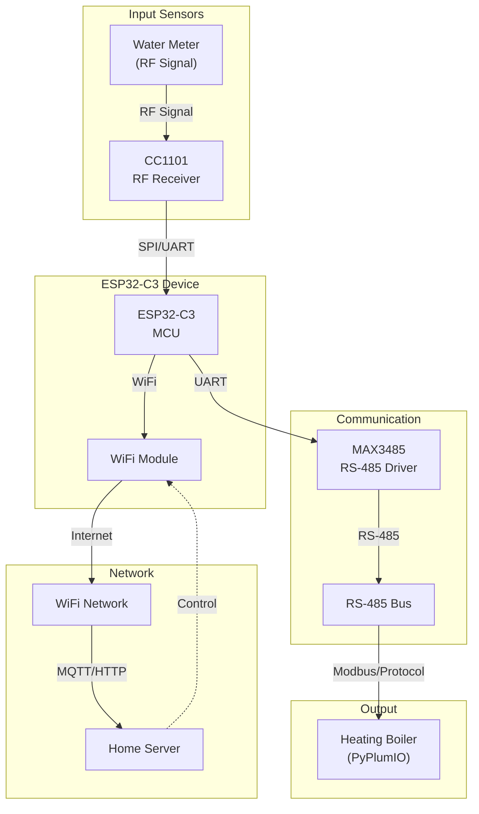

# Water Meter & Boiler Device (ESP32-C3)

IoT device based on ESP32-C3 for reading water meter data and communicating with heating boiler, transmitting data to home server via WiFi.

## System Architecture

## Hardware Components

- **ESP32-C3**: Main microcontroller unit with WiFi
- **CC1101**: RF transceiver module for water meter communication
- **MAX3485**: RS-485 transceiver for boiler communication
- **Water Meter**: RF-based meter for consumption data
- **Heating Boiler**: Controllable via RS-485/Modbus

## Software Integration

- **PyPlumIO**: Python library for heating boiler integration (on home server)
- **ESPHome**: Potential firmware platform for device management
- **MQTT/HTTP**: Communication protocol to home server

## Data Flow

1. **Water Meter Reading**: CC1101 receives RF signals from water meter
2. **Data Processing**: ESP32 decodes meter data
3. **Boiler Communication**: ESP32 transmits control/query commands via RS-485
4. **Cloud Sync**: All data transmitted to home server via WiFi

## Implementation Notes

- Device acts primarily as a data relay and controller
- PyPlumIO integration likely runs on home server (not on ESP32 due to resource constraints)
- RS-485 provides robust communication with boiler

## Next Steps

- [ ] Plan implementation approach (ESPHome vs custom firmware)
- [ ] Define communication protocols for each interface
- [ ] Design hardware integration and pin configuration
- [ ] Plan firmware architecture and data structures
