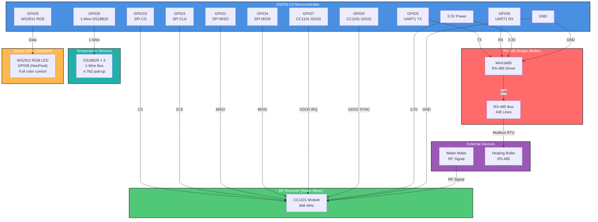

# ESP32-C3 Super Mini Plus Hardware Configuration

## Overview
This document defines the GPIO pin assignments and hardware interface configuration for the water meter and boiler device based on the **ESP32-C3 Super Mini Plus** microcontroller.

**Board Features:**
- Onboard Red Power LED (not controllable)
- Onboard Blue LED (GPIO8, digital control)
- Onboard WS2812 RGB LED (GPIO8, NeoPixel, addressable)
- External antenna (U.FL connector) for better range
- Red PCB variant

## Device Components
- **RF Receiver:** CC1101 (SPI interface)
- **RS-485 Driver:** MAX3485 (UART interface)
- **Status Indicator:** WS2812 RGB LED (GPIO8, NeoPixel addressable) - recommended over blue LED
- **Console:** USB Serial (UART0 - dedicated)

---

## Pin Assignment Summary

| GPIO Pin | Component | Function | Interface | Notes |
|----------|-----------|----------|-----------|-------|
| GPIO0 | CC1101 | GDO2 (sync word detect) | GPIO input | Asserts on sync word received |
| GPIO1 | CC1101 | MISO (Master In, Slave Out) | SPI2 MISO | Data from CC1101 to ESP32-C3 |
| GPIO2 | ❌ SPI flash | SPID (data line) | — | **DO NOT USE** — shared with flash data bus; causes crashes |
| GPIO3 | CC1101 | CLK (Clock) | SPI2 CLK | SPI clock signal |
| GPIO4 | CC1101 | MOSI (Master Out, Slave In) | SPI2 MOSI | Data from ESP32-C3 to CC1101 |
| GPIO5 | RS-485 (MAX3485) | TX | UART1 TX | Serial data transmission to RS-485 |
| GPIO6 | RS-485 (MAX3485) | RX | UART1 RX | Serial data reception from RS-485 |
| GPIO7 | CC1101 | GDO0 (FIFO threshold IRQ) | GPIO input | Asserts when RX FIFO threshold reached |
| GPIO8 | WS2812 RGB LED | Data (NeoPixel) | LED | **Use for status** (conflicts with Blue LED) |
| GPIO9 | DS18B20 (1-Wire) | Data | 1-Wire | Strapping pin — safe with 4.7kΩ pull-up; open-drain stays HIGH at boot |
| GPIO10 | CC1101 | CS (Chip Select) | SPI2 CS | Active low |
| GPIO20 | Console (UART0) | RX | UART0 RX | USB serial console (reserved) |
| GPIO21 | Console (UART0) | TX | UART0 TX | USB serial console (reserved) |

---

## Quick Reference: Pin Connections

### SPI (CC1101 RF Receiver)
| ESP32-C3 | Signal | CC1101 | Function |
|----------|--------|--------|----------|
| GPIO10 | CS | CSn | Chip Select |
| GPIO3 | CLK | DCLK | Clock |
| GPIO1 | MISO | DOUT | Data Out |
| GPIO4 | MOSI | DIN | Data In |
| GPIO7 | GDO0 | GDO0 | RX FIFO threshold IRQ |
| GPIO0 | GDO2 | GDO2 | Sync word detect |
| 3.3V | VCC | VCC | Power |
| GND | GND | GND | Ground |

### UART (RS-485 to Boiler)
| ESP32-C3 | Signal | MAX3485 | Direction |
|----------|--------|---------|-----------|
| GPIO5 | TX | DI | Data In (from ESP) |
| GPIO6 | RX | RO | Receiver Out (to ESP) |
| 3.3V | VCC | VCC | Power |
| GND | GND | GND | Ground |
| GND | - | RE | Receiver Enable |
| GND | - | DE | Driver Enable |
| - | - | A | RS-485 Bus A |
| - | - | B | RS-485 Bus B |

### 1-Wire (DS18B20 Temperature Sensors)
| ESP32-C3 | Signal | DS18B20 | Notes |
|----------|--------|---------|-------|
| GPIO9 | Data | DQ | 4.7kΩ pull-up to 3.3V required |
| 3.3V | VCC | VDD | Power |
| GND | GND | GND | Ground |

Up to 3× DS18B20 sensors on a single bus (parasitic or external power mode).

### GPIO Outputs/Inputs (Status LEDs)

The **ESP32-C3 Super Mini Plus** has 3 LEDs onboard:

| LED | GPIO | Type | Control | Notes |
|-----|------|------|---------|-------|
| Red | None | Power LED | Not controllable | Always on when powered |
| Blue | GPIO8 | Digital | digitalWrite() | Simple on/off control |
| RGB | GPIO8 | NeoPixel (WS2812) | NeoPixel library | Addressable, full color control |

⚠️ **Important:** Blue LED and RGB LED share GPIO8. They use different signal types and **cannot be used simultaneously**. Choose one:
- Use **WS2812 RGB LED** (recommended) for full color status indication
- Use **Blue LED** only if you don't need RGB colors

---

## Interface Configurations

### 1. SPI Interface (for CC1101 RF Receiver)
**SPI Bus:** SPI2 (VSPI)

| Signal | GPIO | Direction | Notes |
|--------|------|-----------|-------|
| MOSI (DIN) | GPIO4 | Output | Master sends data to slave |
| MISO (DOUT) | GPIO1 | Input | Slave sends data to master |
| CLK (SCK) | GPIO3 | Output | SPI clock (max 10 MHz for CC1101) |
| CS (NSS) | GPIO10 | Output | Chip select, active low |
| GDO0 | GPIO7 | Input | RX FIFO threshold interrupt |
| GDO2 | GPIO0 | Input | Sync word detected signal |

**SPI Configuration Parameters:**
- Frequency: 5-10 MHz (CC1101 supports up to 10 MHz)
- Mode: SPI Mode 0 (CPOL=0, CPHA=0)
- Data Width: 8 bits
- MSB First (standard)

**CC1101 Hardware Connections:**
```
CC1101 Pin          | Signal   | GPIO
GND                 | GND      | GND
VCC                 | 3.3V     | 3.3V
1 (GDO2)            | GDO2     | GPIO0
2 (DVCC)            | 3.3V     | 3.3V
3 (DOUT)            | MISO     | GPIO1
4 (DIN)             | MOSI     | GPIO4
5 (DCLK)            | CLK      | GPIO3
6 (CSn)             | CS       | GPIO10
7 (GDO0)            | GDO0     | GPIO7
8 (GND)             | GND      | GND
```

### 2. UART Interface (for MAX3485 RS-485 Driver)
**UART Bus:** UART1

| Signal | GPIO | Direction | Notes |
|--------|------|-----------|-------|
| TX | GPIO5 | Output | UART transmit from ESP32-C3 |
| RX | GPIO6 | Input | UART receive to ESP32-C3 |

**UART Configuration Parameters:**
- Baud Rate: 9600 bps (typical for meter data)
- Data Bits: 8
- Stop Bits: 1
- Parity: None
- Flow Control: None (unless RS-485 requires it)

**RS-485 Hardware Connections:**
```
MAX3485 Pin         | Signal   | GPIO / Power
1 (RO)              | Receiver Output (to data) | RX (GPIO6)
2 (RE)              | Receiver Enable (active low) | GND (always enabled)
3 (DE)              | Driver Enable (active high) | GND (always enabled for RX mode)
4 (DI)              | Driver Input (from data) | TX (GPIO5)
5 (GND)             | Ground | GND
6 (A)               | RS-485 A line | RS-485 Network A
7 (B)               | RS-485 B line | RS-485 Network B
8 (VCC)             | 3.3V or 5V | 3.3V (or 5V with level shifter)
```

**RS-485 Mode Configuration:**
- Rx mode: RE = 0 (low), DE = 0 (low) - Receiver enabled, driver disabled
- Tx mode: RE = 1 (high), DE = 1 (high) - Driver enabled, receiver disabled
- For this design: Connect RE and DE directly to GND for passive reception mode

### 3. Status LED
**GPIO:** GPIO8 (WS2812 NeoPixel)
**Type:** Onboard RGB LED

### 4. Push Button
**GPIO:** GPIO11  
**Type:** User Input  
**Configuration:**
- Active Low (pressed = LOW)
- Internal pull-up enabled
- Debounce: Software debounce recommended (20-50ms)

**Typical Button Circuit:**
```
3.3V ----[10kΩ]---- GPIO11 ---- Button ---- GND
(pull-up resistor, internal pull-up can also be used)
```

---

## Power Supply Requirements

| Component | Voltage | Current | Notes |
|-----------|---------|---------|-------|
| ESP32-C3 | 3.3V | 80-200 mA | Main microcontroller |
| CC1101 | 3.3V | 15-30 mA | RF transceiver |
| MAX3485 | 3.3V-5V | 1-2 mA | RS-485 driver (uses 3.3V in this design) |
| LED | 3.3V | 15 mA | Status indicator |
| Button | - | - | Passive component |

**Total Power Budget:** ~250 mA @ 3.3V

**Power Supply Recommendations:**
- Main: AMS1117-3.3 linear regulator or equivalent (min 1A capacity)
- Decoupling: 100nF ceramic capacitor across VCC-GND (near each IC)
- Bulk: 10μF electrolytic capacitor for the 3.3V rail
- USB: Can power directly if using USB connector on development board

---

## Pin Constraints & Special Considerations

### Reserved/Unavailable Pins
- **GPIO2:** Connected to SPI flash SPID (data line) — toggling during any flash read causes crashes. **DO NOT USE.**
- **GPIO8:** Connected to SPI flash and onboard WS2812 LED — use only for NeoPixel.
- **GPIO20, GPIO21:** Reserved for UART0 (USB serial console).

### Strapping Pins (ESP32-C3)
- **GPIO9** is a strapping pin: LOW at reset → enters download mode (prevents normal boot).
- DS18B20 on GPIO9 is **safe** because 1-Wire is open-drain — the 4.7kΩ pull-up holds the line HIGH at reset. No communication happens during power-on, so the boot mode strapping is unaffected.
- OTA risk: GPIO9 is also SPI flash WP (write protect). A 1-Wire LOW pulse during an active flash write *could* interfere. OTA flashes are infrequent; in practice this is a very low risk.

### GPIO Capabilities
- Max current per GPIO: 40 mA
- Input-only pins: None on ESP32-C3
- Pins with ADC: GPIO0-GPIO5, GPIO11 (ADC1 channel available)
- Pins with PWM: All GPIO pins can be used with PWM (via LEDC peripheral)

### Design Notes
1. **SPI Clock Speed:** CC1101 supports max 10 MHz; configure for 5-10 MHz in firmware
2. **Level Shifting:** Both CC1101 and MAX3485 can operate at 3.3V (confirm with datasheets)
3. **Antenna:** CC1101 requires external antenna (not included in GPIO planning)
4. **Decoupling:** Place 100nF capacitor near power pins of each IC
5. **Grounding:** Use multiple GND connections for better signal integrity

---

## Hardware Wiring Diagram (Mermaid)



---

## Interface Priority & Signal Integrity

### Priority Order (by importance)
1. **SPI (CC1101):** Critical for RF communication
2. **UART (RS-485):** Critical for meter data reception
3. **Status LED:** Important for user feedback
4. **Button:** Optional for user interaction

### Signal Integrity Best Practices
1. Keep SPI lines short and together (group MOSI, MISO, CLK, CS)
2. Keep UART TX/RX twisted or close together
3. Place 100nF ceramic capacitor across VCC-GND near each IC
4. Use star grounding from central point to ESP32-C3
5. Minimize antenna interference with digital signals
6. Use USB cable shielding if powered via USB

---

## Firmware Configuration Examples

### ESPHome YAML (GPIO Definition Reference)
```yaml
esphome:
  name: water-meter-wmbus

esp32:
  board: esp32-c3-devkitm-1
  framework:
    type: esp-idf

spi:
  clk_pin: GPIO3
  mosi_pin: GPIO4
  miso_pin: GPIO1

wmbus_radio:
  radio_type: CC1101
  cs_pin: GPIO10
  irq_pin: GPIO7   # GDO0

uart:
  id: uart_rs485
  tx_pin: GPIO5
  rx_pin: GPIO6
  baud_rate: 9600

dallas_temp:
  pin: GPIO9        # 4.7kΩ pull-up to 3.3V required
```

---

## Verification Checklist

- [x] All GPIO pins assigned without conflicts
- [x] Flash memory pins (GPIO2 SPID, GPIO8) reserved and documented
- [x] UART0 (20, 21) reserved for console
- [x] SPI bus pins documented (CLK=3, MOSI=4, MISO=1, CS=10)
- [x] CC1101 GDO pins documented (GDO0=7, GDO2=0)
- [x] DS18B20 1-Wire assigned to GPIO9 (strapping pin safe with pull-up)
- [x] Power supply requirements documented
- [x] Decoupling capacitor placement specified
- [x] Signal integrity guidelines provided
- [x] Wiring diagram included
- [x] Compatible with ESP32-C3 development boards

---

## Next Steps

1. **PCB Design:** Use this pin assignment for PCB layout
2. **ESPHome Configuration:** Implement YAML with these GPIO definitions
3. **Firmware Testing:** Test SPI communication with CC1101
4. **UART Verification:** Verify RS-485 data reception at 9600 bps
5. **Integration Testing:** Combine all interfaces for full device functionality

---

## References

- ESP32-C3 Datasheet: https://www.espressif.com/en/products/socs/esp32-c3
- CC1101 Datasheet: https://www.ti.com/product/CC1101
- MAX3485 Datasheet: https://datasheets.maximintegrated.com/en/ds/MAX3485.pdf
- ESPHome Documentation: https://esphome.io/

---

**Document Version:** 1.2  
**Last Updated:** 2026-05-18  
**Status:** Complete — reflects actual soldered hardware + DS18B20 planned
