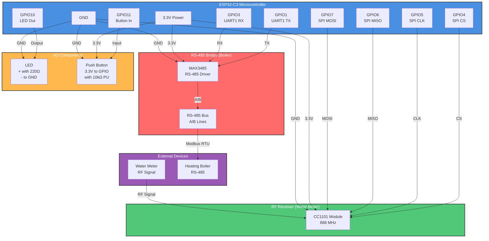

# ESP32-C3 Hardware Configuration

## Overview
This document defines the GPIO pin assignments and hardware interface configuration for the water meter and boiler device based on the ESP32-C3 microcontroller.

## Device Components
- **RF Receiver:** CC1101 (SPI interface)
- **RS-485 Driver:** MAX3485 (UART interface)
- **Status Indicator:** LED
- **User Input:** Push Button
- **Console:** USB Serial (UART0 - dedicated)

---

## Pin Assignment Summary

| GPIO Pin | Component | Function | Interface | Notes |
|----------|-----------|----------|-----------|-------|
| GPIO0 | (Reserved) | SPI Flash DO | Internal | DO NOT USE - SPI Flash |
| GPIO1 | RS-485 (MAX3485) | TX | UART1 TX | Serial data transmission to RS-485 |
| GPIO2 | (Reserved) | SPI Flash WP | Internal | DO NOT USE - SPI Flash |
| GPIO3 | RS-485 (MAX3485) | RX | UART1 RX | Serial data reception from RS-485 |
| GPIO4 | CC1101 | CS (Chip Select) | SPI2 CS | Active low |
| GPIO5 | CC1101 | CLK (Clock) | SPI2 CLK | SPI clock signal |
| GPIO6 | CC1101 | MISO (Master In, Slave Out) | SPI2 MISO | Data from CC1101 to ESP32-C3 |
| GPIO7 | CC1101 | MOSI (Master Out, Slave In) | SPI2 MOSI | Data from ESP32-C3 to CC1101 |
| GPIO8 | (Reserved) | SPI Flash CLK | Internal | DO NOT USE - SPI Flash |
| GPIO9 | (Reserved) | SPI Flash CS | Internal | DO NOT USE - SPI Flash |
| GPIO10 | LED Status | Output | GPIO | Status indicator (active high) |
| GPIO11 | Button (User Input) | Input | GPIO | Push button input (with pull-up) |
| GPIO20 | Console (UART0) | RX | UART0 RX | USB serial console (reserved) |
| GPIO21 | Console (UART0) | TX | UART0 TX | USB serial console (reserved) |

---

## Quick Reference: Pin Connections

### SPI (CC1101 RF Receiver)
| ESP32-C3 | Signal | CC1101 | Function |
|----------|--------|--------|----------|
| GPIO4 | CS | CSn | Chip Select |
| GPIO5 | CLK | DCLK | Clock |
| GPIO6 | MISO | DOUT | Data Out |
| GPIO7 | MOSI | DIN | Data In |
| 3.3V | VCC | VCC | Power |
| GND | GND | GND | Ground |

### UART (RS-485 to Boiler)
| ESP32-C3 | Signal | MAX3485 | Direction |
|----------|--------|---------|-----------|
| GPIO1 | TX | DI | Data In (from ESP) |
| GPIO3 | RX | RO | Receiver Out (to ESP) |
| 3.3V | VCC | VCC | Power |
| GND | GND | GND | Ground |
| GND | - | RE | Receiver Enable |
| GND | - | DE | Driver Enable |
| - | - | A | RS-485 Bus A |
| - | - | B | RS-485 Bus B |

### GPIO Outputs/Inputs
| GPIO | Component | Signal | Configuration |
|------|-----------|--------|---|
| GPIO10 | LED | Status | Output (active high, 220Ω resistor) |
| GPIO11 | Button | User Input | Input (active low, 10kΩ pull-up) |

---

## Interface Configurations

### 1. SPI Interface (for CC1101 RF Receiver)
**SPI Bus:** SPI2 (VSPI)

| Signal | GPIO | Direction | Notes |
|--------|------|-----------|-------|
| MOSI (DIN) | GPIO7 | Output | Master sends data to slave |
| MISO (DOUT) | GPIO6 | Input | Slave sends data to master |
| CLK (SCK) | GPIO5 | Output | SPI clock (max 10 MHz for CC1101) |
| CS (NSS) | GPIO4 | Output | Chip select, active low |

**SPI Configuration Parameters:**
- Frequency: 5-10 MHz (CC1101 supports up to 10 MHz)
- Mode: SPI Mode 0 (CPOL=0, CPHA=0)
- Data Width: 8 bits
- MSB First (standard)

**CC1101 Hardware Connections:**
```
CC1101 Pin          | Signal   | GPIO
GND                 | GND      | GND
VCC                 | 3.3V     | 3.3V
1 (GND)             | GND      | GND
2 (DVCC)            | 3.3V     | 3.3V
3 (DOUT)            | MISO     | GPIO6
4 (DIN)             | MOSI     | GPIO7
5 (DCLK)            | CLK      | GPIO5
6 (CSn)             | CS       | GPIO4
7 (GND)             | GND      | GND
8 (GND)             | GND      | GND
```

### 2. UART Interface (for MAX3485 RS-485 Driver)
**UART Bus:** UART1

| Signal | GPIO | Direction | Notes |
|--------|------|-----------|-------|
| TX | GPIO1 | Output | UART transmit from ESP32-C3 |
| RX | GPIO3 | Input | UART receive to ESP32-C3 |

**UART Configuration Parameters:**
- Baud Rate: 9600 bps (typical for meter data)
- Data Bits: 8
- Stop Bits: 1
- Parity: None
- Flow Control: None (unless RS-485 requires it)

**RS-485 Hardware Connections:**
```
MAX3485 Pin         | Signal   | GPIO / Power
1 (RO)              | Receiver Output (to data) | RX (GPIO3)
2 (RE)              | Receiver Enable (active low) | GND (always enabled)
3 (DE)              | Driver Enable (active high) | GND (always enabled for RX mode)
4 (DI)              | Driver Input (from data) | TX (GPIO1)
5 (GND)             | Ground | GND
6 (A)               | RS-485 A line | RS-485 Network A
7 (B)               | RS-485 B line | RS-485 Network B
8 (VCC)             | 3.3V or 5V | 3.3V (or 5V with level shifter)
```

**RS-485 Mode Configuration:**
- Rx mode: RE = 0 (low), DE = 0 (low) - Receiver enabled, driver disabled
- Tx mode: RE = 1 (high), DE = 1 (high) - Driver enabled, receiver disabled
- For this design: Connect RE and DE directly to GND for passive reception mode

### 3. Status LED
**GPIO:** GPIO10  
**Type:** Status Indicator  
**Configuration:**
- Active High (LED on when GPIO10 = HIGH)
- Recommended: 220Ω resistor in series
- Voltage: 3.3V (max 40mA per GPIO)
- Color: Typically Red or Green (user preference)

**Typical LED Circuit:**
```
GPIO10 ----[220Ω]----[LED+]----GND
(cathode is connected to GND)
```

### 4. Push Button
**GPIO:** GPIO11  
**Type:** User Input  
**Configuration:**
- Active Low (pressed = LOW)
- Internal pull-up enabled
- Debounce: Software debounce recommended (20-50ms)

**Typical Button Circuit:**
```
3.3V ----[10kΩ]---- GPIO11 ---- Button ---- GND
(pull-up resistor, internal pull-up can also be used)
```

---

## Power Supply Requirements

| Component | Voltage | Current | Notes |
|-----------|---------|---------|-------|
| ESP32-C3 | 3.3V | 80-200 mA | Main microcontroller |
| CC1101 | 3.3V | 15-30 mA | RF transceiver |
| MAX3485 | 3.3V-5V | 1-2 mA | RS-485 driver (uses 3.3V in this design) |
| LED | 3.3V | 15 mA | Status indicator |
| Button | - | - | Passive component |

**Total Power Budget:** ~250 mA @ 3.3V

**Power Supply Recommendations:**
- Main: AMS1117-3.3 linear regulator or equivalent (min 1A capacity)
- Decoupling: 100nF ceramic capacitor across VCC-GND (near each IC)
- Bulk: 10μF electrolytic capacitor for the 3.3V rail
- USB: Can power directly if using USB connector on development board

---

## Pin Constraints & Special Considerations

### Reserved/Unavailable Pins
- **GPIO0, GPIO2, GPIO8, GPIO9:** Connected to SPI flash IC - DO NOT USE for any other purpose
- **GPIO20, GPIO21:** Reserved for UART0 (USB serial console)
- **GPIO12-GPIO19:** Strapping pins - use with caution during boot

### Strapping Pins (ESP32-C3)
- GPIO2: Must be LOW during boot (SPI flash mode)
- GPIO8, GPIO9: Used for SPI flash
- Pull-ups/pull-downs should not interfere with proper boot sequencing

### GPIO Capabilities
- Max current per GPIO: 40 mA
- Input-only pins: None on ESP32-C3
- Pins with ADC: GPIO0-GPIO5, GPIO11 (ADC1 channel available)
- Pins with PWM: All GPIO pins can be used with PWM (via LEDC peripheral)

### Design Notes
1. **SPI Clock Speed:** CC1101 supports max 10 MHz; configure for 5-10 MHz in firmware
2. **Level Shifting:** Both CC1101 and MAX3485 can operate at 3.3V (confirm with datasheets)
3. **Antenna:** CC1101 requires external antenna (not included in GPIO planning)
4. **Decoupling:** Place 100nF capacitor near power pins of each IC
5. **Grounding:** Use multiple GND connections for better signal integrity

---

## Hardware Wiring Diagram (Mermaid)



---

## Hardware Wiring Diagram (ASCII)

```
┌─────────────────────────────────────────────────────────────┐
│                        ESP32-C3                              │
│  ┌──────────────────────────────────────────────────────┐   │
│  │ GPIO0  (Reserved - SPI Flash DO)                    │   │
│  │ GPIO1  ──────────────────────────── RS-485 TX       │   │
│  │ GPIO2  (Reserved - SPI Flash WP)                    │   │
│  │ GPIO3  ──────────────────────────── RS-485 RX       │   │
│  │ GPIO4  ──────────────────────────── CC1101 CS       │   │
│  │ GPIO5  ──────────────────────────── CC1101 CLK      │   │
│  │ GPIO6  ──────────────────────────── CC1101 MISO     │   │
│  │ GPIO7  ──────────────────────────── CC1101 MOSI     │   │
│  │ GPIO8  (Reserved - SPI Flash CLK)                   │   │
│  │ GPIO9  (Reserved - SPI Flash CS)                    │   │
│  │ GPIO10 ──────────────────────────── LED Status      │   │
│  │ GPIO11 ──────────────────────────── Button Input    │   │
│  │ GPIO20 (UART0 RX - USB Console)                     │   │
│  │ GPIO21 (UART0 TX - USB Console)                     │   │
│  │                                                      │   │
│  │ 3.3V ────────────────┬────────────────────────────┐ │   │
│  │ GND  ────────────────┼────────────────────────────┼─┼─┐ │
│  └──────────────────────┼────────────────────────────┼─┼─┼──┘
│                         │                            │ │ │
├─────────────────────────┼────────────────────────────┼─┼─┼──┐
│                         │                            │ │ │  │
│  ┌─────────────────────┴───────────────────────────┘ │ │  │
│  │                                                    │ │  │
│  ▼ 3.3V                                              │ │  │
│ ┌──────────────────────────────────┐                 │ │  │
│ │        CC1101 RF Module           │                 │ │  │
│ │ ┌──────────────────────────────┐  │                 │ │  │
│ │ │ DIN   ◄─── GPIO7 (MOSI)      │  │                 │ │  │
│ │ │ DOUT  ──► GPIO6 (MISO)       │  │                 │ │  │
│ │ │ DCLK  ◄─── GPIO5 (CLK)       │  │                 │ │  │
│ │ │ CSn   ◄─── GPIO4 (CS)        │  │                 │ │  │
│ │ │ VCC   ◄─── 3.3V              │  │                 │ │  │
│ │ │ GND   ◄─── GND               │  │                 │ │  │
│ │ │ ANT   ─── Antenna            │  │                 │ │  │
│ │ └──────────────────────────────┘  │                 │ │  │
│ └──────────────────────────────────┘                 │ │  │
│                                                       │ │  │
│  ┌───────────────────────────────────────┐           │ │  │
│  │      MAX3485 RS-485 Driver            │           │ │  │
│  │ ┌─────────────────────────────────┐   │           │ │  │
│  │ │ DI    ◄─── GPIO1 (TX from ESP)  │   │           │ │  │
│  │ │ RO    ──► GPIO3 (RX to ESP)     │   │           │ │  │
│  │ │ DE    ◄─── GND (Driver Enable)  │   │           │ │  │
│  │ │ RE    ◄─── GND (Receiver Enable)│   │           │ │  │
│  │ │ VCC   ◄─── 3.3V                 │   │           │ │  │
│  │ │ GND   ◄─── GND                  │   │           │ │  │
│  │ │ A     ──► RS-485 Bus A          │   │           │ │  │
│  │ │ B     ──► RS-485 Bus B          │   │           │ │  │
│  │ └─────────────────────────────────┘   │           │ │  │
│  └───────────────────────────────────────┘           │ │  │
│                                                       │ │  │
│  ┌──────────────────────────────────────┐            │ │  │
│  │         Status LED (GPIO10)          │            │ │  │
│  │ GPIO10 ────[220Ω]──[LED+]───────────►├────────────┘ │  │
│  └──────────────────────────────────────┘              │  │
│                                                        │  │
│  ┌──────────────────────────────────────┐             │  │
│  │      Push Button (GPIO11)            │             │  │
│  │ 3.3V ────[10kΩ]────┬──► GPIO11      │             │  │
│  │                    │                 │             │  │
│  │              ┌─────┴─────┐           │             │  │
│  │              │   Button  │           │             │  │
│  │              │   (NO)    │           │             │  │
│  │              └─────┬─────┘           │             │  │
│  │                    │                 │             │  │
│  │                   GND ◄──────────────┴─────────────┘  │
│  └──────────────────────────────────────┘                │
│                                                           │
│  3.3V ─── 100nF Cap ─── GND (decoupling, all ICs)        │
│  3.3V ─── 10μF Cap ──── GND (bulk capacitor)             │
└───────────────────────────────────────────────────────────┘
```

---

## Interface Priority & Signal Integrity

### Priority Order (by importance)
1. **SPI (CC1101):** Critical for RF communication
2. **UART (RS-485):** Critical for meter data reception
3. **Status LED:** Important for user feedback
4. **Button:** Optional for user interaction

### Signal Integrity Best Practices
1. Keep SPI lines short and together (group MOSI, MISO, CLK, CS)
2. Keep UART TX/RX twisted or close together
3. Place 100nF ceramic capacitor across VCC-GND near each IC
4. Use star grounding from central point to ESP32-C3
5. Minimize antenna interference with digital signals
6. Use USB cable shielding if powered via USB

---

## Firmware Configuration Examples

### ESPHome YAML (GPIO Definition Reference)
```yaml
esphome:
  name: water-meter-device

esp32_c3:
  board: esp32-c3-devkitm-1

spi:
  clk_pin: GPIO5
  mosi_pin: GPIO7
  miso_pin: GPIO6

uart:
  id: uart_rs485
  tx_pin: GPIO1
  rx_pin: GPIO3
  baud_rate: 9600

button:
  - platform: gpio
    pin: GPIO11
    name: "User Button"
    
output:
  - platform: gpio
    pin: GPIO10
    id: led_status
    
status_led:
  pin: GPIO10
```

---

## Verification Checklist

- [x] All GPIO pins assigned without conflicts
- [x] Flash memory pins (0, 2, 8, 9) reserved
- [x] UART0 (20, 21) reserved for console
- [x] SPI bus uses standard pins (4, 5, 6, 7)
- [x] Power supply requirements documented
- [x] Decoupling capacitor placement specified
- [x] Signal integrity guidelines provided
- [x] ASCII wiring diagram included
- [x] Compatible with ESP32-C3 development boards

---

## Next Steps

1. **PCB Design:** Use this pin assignment for PCB layout
2. **ESPHome Configuration:** Implement YAML with these GPIO definitions
3. **Firmware Testing:** Test SPI communication with CC1101
4. **UART Verification:** Verify RS-485 data reception at 9600 bps
5. **Integration Testing:** Combine all interfaces for full device functionality

---

## References

- ESP32-C3 Datasheet: https://www.espressif.com/en/products/socs/esp32-c3
- CC1101 Datasheet: https://www.ti.com/product/CC1101
- MAX3485 Datasheet: https://datasheets.maximintegrated.com/en/ds/MAX3485.pdf
- ESPHome Documentation: https://esphome.io/

---

**Document Version:** 1.0  
**Last Updated:** 2024  
**Status:** Complete
